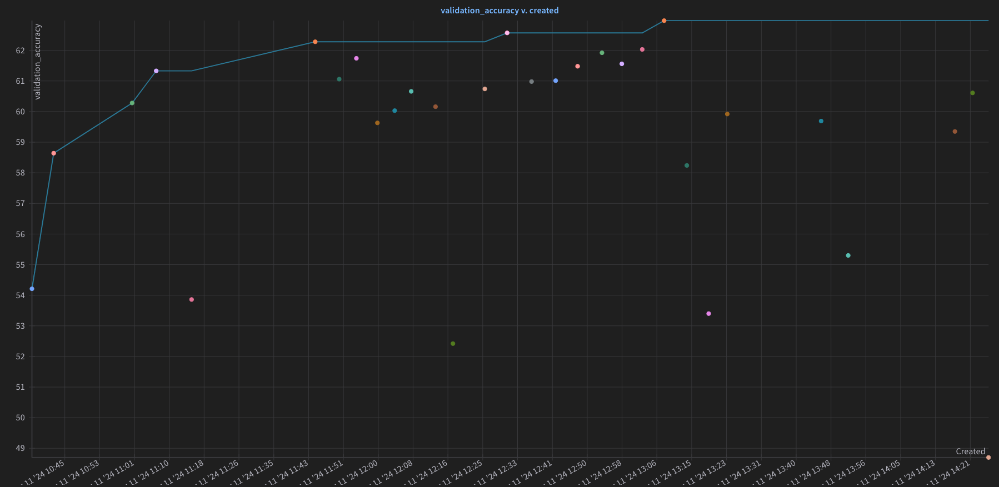

# Automated Hyperparameter Tuning for CNN on CIFAR-100

Entry point to code is: part_2_cifar.py

## Objective 🎯

The goal of this project is to perform automated hyperparameter tuning to determine the optimal settings for a Convolutional Neural Network (CNN) designed to classify images from the CIFAR-100 dataset.

## Setup Instructions 🛠️

### Environment Setup

1. Clone the Repository:

- Clone this repository to your local machine or development environment.

```bash
git clone <repository-url>
```

2. Install Dependencies:

- Ensure that Python 3.6+ is installed on your system.
- Install the required Python libraries:

```bash
pip install torch torchvision tensorrt pycuda wandb matplotlib numpy
```

3. Weights & Biases Setup:

- Sign up or log in to Weights & Biases and configure your environment:

```bash
wandb login
```

### Data Preparation 📦

- The CIFAR-100 dataset is automatically downloaded using the TorchVision library. Ensure you have a stable internet connection.

## Model Architecture 🏗️

The CNN model used in this project consists of the following layers:

- Three Convolutional Layers: Each followed by batch normalization and max pooling.
- Dropout Layers: To prevent overfitting.
- Fully Connected Layers: Ending with a softmax layer for classification.

Summary:

SimpleCNN(
  (conv1): Conv2d(3, 64, kernel_size=(3, 3), stride=(1, 1), padding=(1, 1))
  (conv2): Conv2d(64, 128, kernel_size=(3, 3), stride=(1, 1), padding=(1, 1))
  (conv3): Conv2d(128, 256, kernel_size=(3, 3), stride=(1, 1), padding=(1, 1))
  (bn): BatchNorm2d(256, eps=1e-05, momentum=0.1, affine=True, track_running_stats=True)
  (pool): MaxPool2d(kernel_size=2, stride=2, padding=0, dilation=1, ceil_mode=False)
  (dropout): Dropout(p=0.25, inplace=False)
  (fc1): Linear(in_features=4096, out_features=512, bias=True)
  (fc2): Linear(in_features=512, out_features=256, bias=True)
  (fc3): Linear(in_features=256, out_features=100, bias=True)
)

## Hyperparameter Tuning 🔄

Configuration

- Hyperparameters Tuned: Learning rate, batch size, number of filters in convolutional layers, dropout rate.

### Tuning Process

- Tool Used: Weights & Biases Sweeps
- Method: Bayesian Optimization
- Execution: This process involves running multiple training sessions with different combinations of hyperparameters to identify the set that achieves the highest validation accuracy.

### Start the Hyperparameter Tuning Process

```bash
wandb sweep sweep_config.json
wandb agent <sweep-id>
```

This will automatically perform the experiments, logging all results to your Weights & Biases dashboard.

## Training 🏃‍♂️

The training loop involves loading the dataset, applying transformations (normalization, augmentation), running training and validation in epochs, and logging results to Weights & Biases for monitoring.

### Hyperparameter Tuning

**Method**: Bayes

Bayesian Optimization is an effective strategy when you have a limited budget for running experiments or when individual runs are costly in terms of time or resources. It uses past evaluation results to form a probabilistic model mapping hyperparameters to a probability of a score on the objective function and then chooses new hyperparameters to test by optimizing the acquisition function over the probabilistic model.

**Metric**: Validation Accuracy
**Goal**: maximize

This setting aims to find hyperparameters that yield the highest validation accuracy, which is a common goal for classification tasks to ensure the model performs well on unseen data.

#### Parameters

##### Number of Filters

These parameters define the depth of the convolutional layers, affecting the model's capacity to learn detailed features at various levels of abstraction. A larger number of filters allows the network to learn more complex patterns.
Values are chosen to explore a reasonable range that balances model complexity and computational efficiency. For example, increasing the number of filters enhances the model's ability to represent more complex features, but it also increases computational cost and the risk of overfitting if not paired with adequate regularization.
Dropout Rate (dropout_rate):

##### Dropout

Dropout is a regularization technique used to prevent overfitting. The specified values (0.125, 0.25, 0.5) offer a range from light to heavy regularization. Testing different rates helps in identifying the optimal balance between regularization and the ability to learn complex patterns.
Learning Rate (learning_rate):

##### Learning Rate

The learning rate is crucial for training neural networks as it determines how much to update the model in response to the estimated error each time the model weights are updated.
A uniform distribution between 1e-4 to 1e-2 provides a broad spectrum to find a sweet spot where the learning is neither too slow (which could get stuck in local minima) nor too fast (which could overshoot minima).

##### Momentum

Momentum helps accelerate SGD in the relevant direction and dampens oscillations. It is a technique that helps the optimizer to navigate along the relevant directions and smoothens the updates.
A uniform distribution from 0.8 to 0.99 allows for exploring a range of momentum values where the momentum is significant but not overwhelmingly high, which might lead to instability in the learning process.

##### Batch Size

Batch size influences the accuracy of the estimate of the error gradient when training neural networks.
Multiple values are chosen to show how batch size impacts the efficiency and performance of the network. Smaller batch sizes can offer a regularizing effect and higher convergence, while larger batch sizes provide better computational efficiency.

Larger batch sizes provide a more accurate estimate of the gradient. This reduces the variance in the updates, leading to a smoother convergence process. However, this can also lead to potential downsides like a higher likelihood of settling in sharp minima unless specific techniques like learning rate warm-up or adjustment are employed.

##### Epochs

Represents the number of times the learning algorithm will work through the entire training dataset.
A quantized uniform distribution from 30 to 50 with a step of 5 allows for evaluating different durations of training to balance between underfitting and overfitting, as well as computational feasibility.

#### Model Configuration Impact

num_filters_1, num_filters_2, num_filters_3: Adjusting these parameters directly impacts the depth and complexity of the feature extraction part of the network. Each layer’s ability to transform its input data into more abstract and composite representations is partially dependent on the number of filters. More filters provide a network with more capacity to learn detailed features but require more data to effectively train and can lead to overfitting in smaller datasets.
This configuration effectively explores different architectures and regularization techniques to find the best model settings for the given dataset, balancing model complexity and training efficiency.

## Results and Observations 📊

The hyperparameter tuning results can be viewed via an interactive report on this server: https://wandb.ai/arjvn/SimpleCNN/sweeps/bkx8n4t2?nw=nwuserarjvn. 

Let me know if you cant access it - pdf print: part_2/bayes_hyperparameter_opt_cnn.pdf

[](https://wandb.ai/arjvn/SimpleCNN/sweeps/b6udp0vp?nw=nwuserarjvn)

### Hyperparameter Tuning Impact

The comparison between the initial and best-performing runs from your sweep highlights the significant impact of hyperparameter tuning on model performance:

#### Initial Run

- Validation Accuracy: 54.21%
- Training Accuracy: 51.196%

This run used higher dropout and fewer filters in the initial layers, which, while regularizing the model, might have limited its ability to capture complex features effectively, resulting in lower performance.

#### Best-Performing Run

- Validation Accuracy: 62.97%
- Training Accuracy: 73.446%

The optimized hyperparameters included more filters in the initial layers and a balanced dropout rate, allowing the model to learn more detailed features without overfitting, thus significantly improving accuracy.

#### Model Architecture Choice

The choice of a simple CNN architecture was strategic to clearly evaluate how different hyperparameters influence the model's ability to generalize from the training data to unseen data. This approach ensures that the enhancements in model performance can be attributed primarily to changes in hyperparameters rather than the complexity of the model architecture itself.

#### Analyzing and Discussing Model Performance

Improvement Analysis: Between the first and the best-performing sweeps, improvements in validation accuracy and training loss were notable. These improvements underscore the effectiveness of tuning parameters like the number of filters, which have a direct impact on the model's capacity, and learning rate and momentum, which influence how the model converges during training.

### Conclusion and Further Steps

Efficiency of Hyperparameter Tuning: The project demonstrates that even simple architectures can achieve significant improvements with the right set of hyperparameters. Bayesian optimization helped in navigating the hyperparameter space more efficiently than random or grid search could, especially given the computational costs.

Scalability: This approach sets a foundation for scaling up experiments. With the basics in place, similar strategies can be applied to more complex models or larger datasets, potentially increasing performance further.

Continuous Improvement: The process doesn't end with finding a set of good parameters. As new data becomes available or as computational resources evolve, continuous re-evaluation and tuning based on new experiments could further enhance performance.
